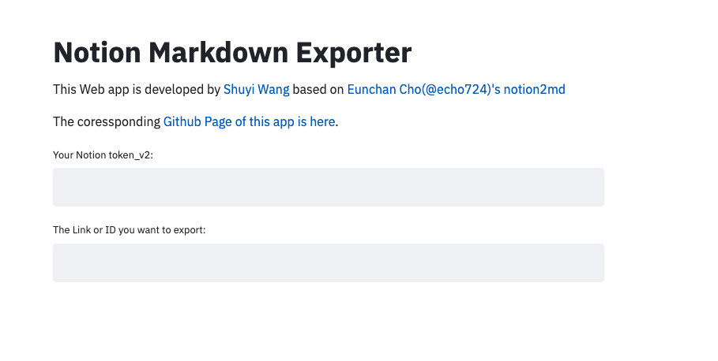
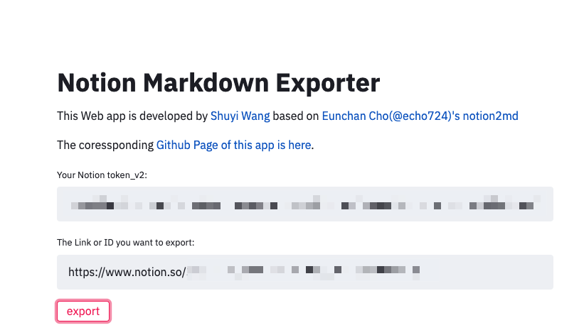
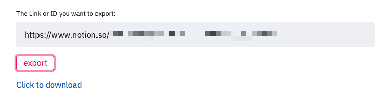
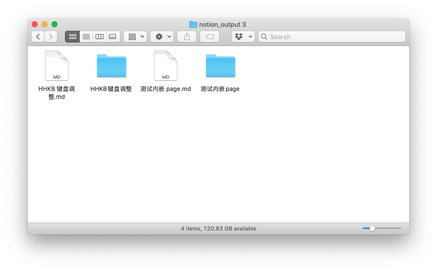
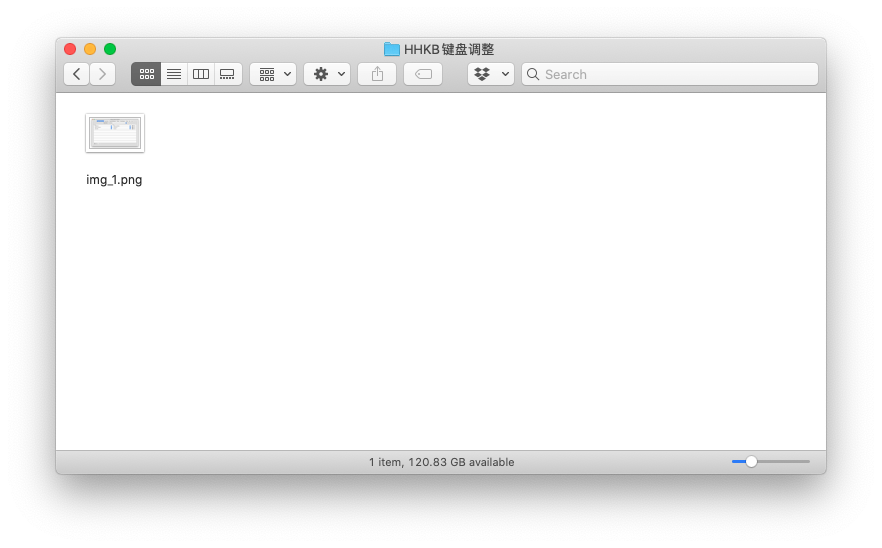
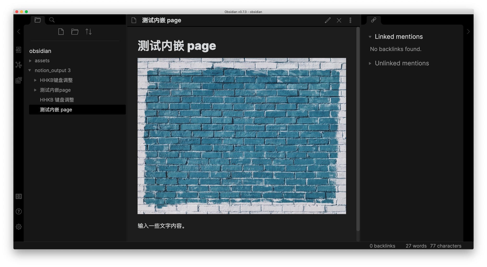
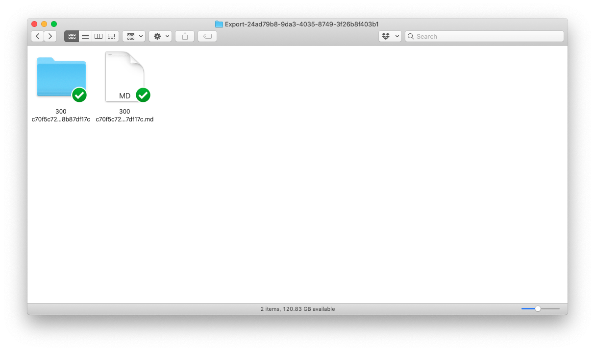
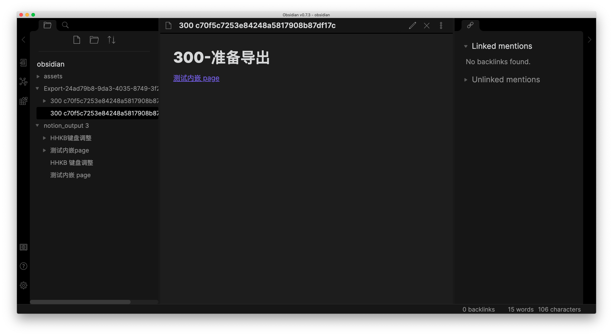
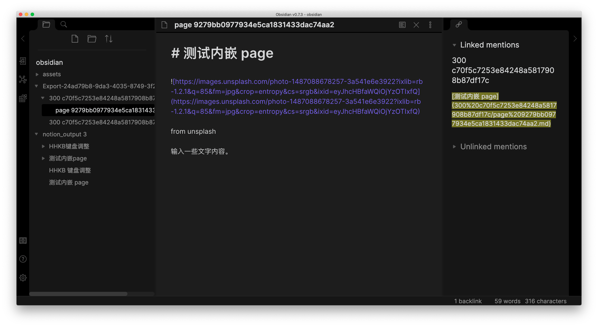

This web-based app can help you to batch export notion pages to Markdown format correctly. 

Please follow these simple steps.

Step 1. [Open this link](http://notion-to-markdown.herokuapp.com/), and you will see the web interface.

Step 2. Get your notion token_v2 and input it in the first textbox. You can learn how to get your token by [reading this web page](https://www.redgregory.com/notion/2020/6/15/9zuzav95gwzwewdu1dspweqbv481s5).

Step 3. Move **all the pages** you want to export to a new page. 

As you may see, links to pages are also acceptable. In this case, you don't need to move the pages at all.

Step 4. Please copy the link to the new page and input it in the second textbox and press Enter. 

Step 5. You will see a new button named "export." Click it.

Step 6. When you see a new link named "Click to download" shown on the web page, click it and download a zip file. Extract it, and you will find all the Markdown files as well as the images.

Step 7. (Optional) You can drag the folder to Obsidian's Root Directory and browse the Markdown files.

As you can see here, all the titles of pages are kept as the name of Markdown files.

In contrast, if you export the Markdown files using the default export function in notion, you will get an extracted directory like this.

If you put it into Obsidian, you will realize the linked sub-page was not downloaded at all.

Besides, in the subfolder, there is no image file. The image is still in the cloud.

If you like this app, please add a star to [my Github Repo](https://github.com/wshuyi/demo-notion-markdown-exporter). Thanks! 

That's all. Enjoy! :)

